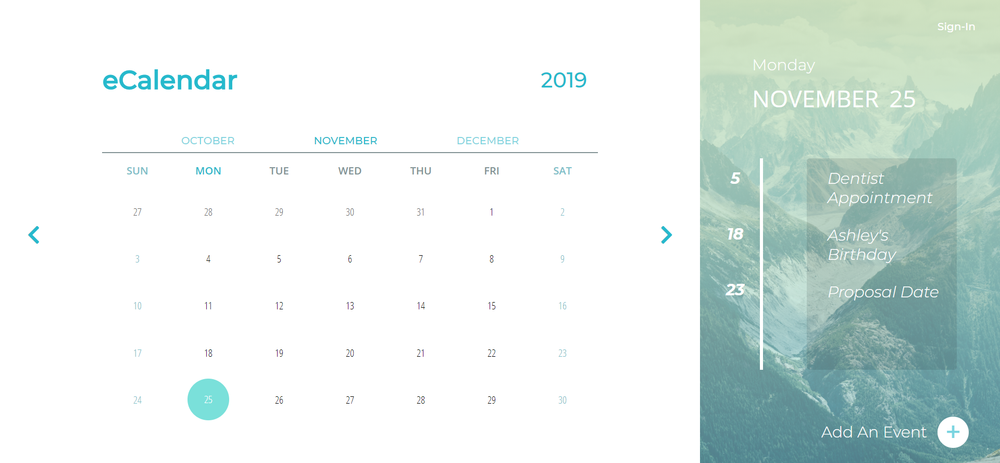
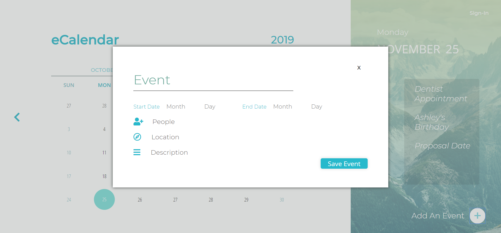

# Chingu Solo Project - Tier 1 - eCalendar

 

## Overview 

This project is a great opportunity to develop a clean and modern webpage. The *eCalendar* app will be completed across tiers, with each tier adding a new level of complexity. You are currently on the **Tier 1 repo**. You'll be responsible for coding the **HTML**, **CSS**, and **JavaScript** to get the structure, styling, and some basic functionality up and running.

As you add skills to your developer toolbag you'll be able to come back to this project and add in the Tier 2 and Tier 3 features. Ultimately you'll have a great portfolio piece, and will have implemented a number of common and in-demand features.

**No Frameworks, Libraries, or Code Generators May Be Used In This Tier**

## Instructions

Remember, this project must be completed with **vanilla** (plain) HTML, CSS, and JavaScript. Do not use front-end frameworks or libraries *(JQuery, Bootstrap, etc.)*.

General instructions for all Pre-Work Projects can also be found in the Chingu Voyage Handbook (URL posted in the #read-me-first channel on Discord).

#### Requirements

*Structure*

- [ ] Page divided into calendar potion and event list portion

- [ ] Calendar portion to have:  

  - [ ] Title and Current year in header  
  - [ ] Current month between previous and upcoming month 
  - [ ] Calendar dates of the month with display of previous month’s last dates if first day of current month does not start on a Sunday 
  - [ ] Arrows bordering the body of the calendar 

- [ ] Event portion to have.

  - [ ]  Current day of the week displayed  
  - [ ]  Current month and date (numerical) displayed  
  - [ ]  List of Events with corresponding date of month divided by a vertical bar  
  - [ ]  Add event button at bottom 

- [ ] *At least* **3** demo events in the event panel portion of the project 

- [ ] A modal form activated via button click that floats above the content

*Styling:*

- [ ] Colors should match the theming outlined in the demo page 

 - [ ] Previous month dates greyed out  `#696868`
 - [ ] Current month weekend dates and weekdays separate colors `#7cc0c9` `#839395`
 - [ ] Current date highlighted in a circular div `#26B9CC`
 - [ ] Gradient over background image (provided in assets folder)
 
 ##### Code for gradient
 ```css
 linear-gradient: linear-gradient(180deg, rgba(209, 226, 188, 0.9) 0%, rgba(255, 255, 255, 0) 100%), rgba(160, 236, 247, 0.5);
 ```

- [ ] Use corresponding fonts per section of the calendar page. 
- [ ] Invisible scroll bar for event section
- [ ] Utilize the following fonts in the calendar free for use from Google Fonts - *Montserrat, Open Sans* and *Open Sans Condensed*  
      Hints: These fonts are used with multiple font-weights and italics
- [ ] Event list should have at minimum three demo events hardcoded in with the date on the *left of the horizontal bar* and the event name *on the right*

*Functionality*

*Upon Load:*

- [ ] Calendar will display correct layout of the current month with the weeks starting on Sunday **No month scrolling is required**, only load the current month dates via *vanilla Javascript*
- [ ] Will display last dates of previous month if the current month does not start on a Sunday 
- [ ] A div will highlight the present day of the month as well as the current weekdate of the month (ex:// on Tuesday the 19th, both *Tues above the calendar dates and the 19th* will have special styling to indicate the present date!)
- [ ] All other corresponding theming will match the correct dates according to their place in the week


*Modal Form:*

- [ ] Be able to close form without submission and have form close on submission of event information
- [ ] Have modal displayed as shown in the demo. This form is **not** expected to be functional.
- [ ] Is hidden when not in use


*Other:*

- [ ] Your repo needs to have a robust README.md
- [ ] Make sure that there are no errors in the developer console before submitting

**Extras (Not Required)**

- [ ] Make your design fully responsive *(small/large/portrait/landscape, etc.)*
- [ ] optimized loading of calendar site (hint, consider the background image)

## Example

*The static images below are used to allow for a clear view of both the calendar and modal form*



 
